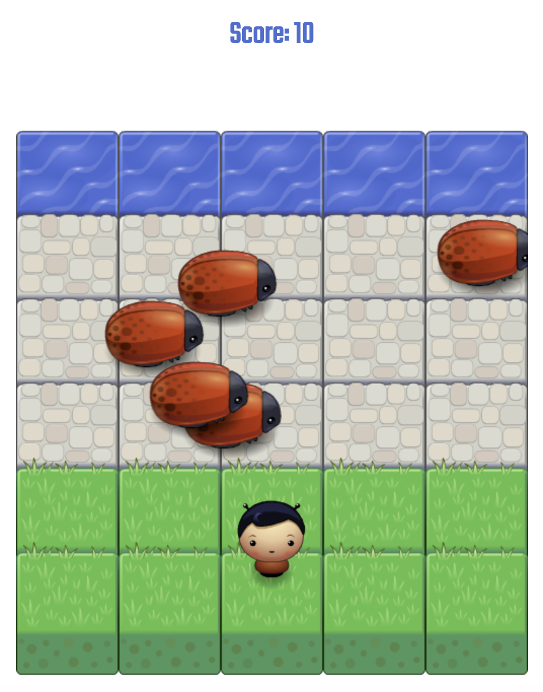

# Classic Arcade Game Clone Project

## Table of Contents

- [How to Run the Game?](#how-to-run-the-game)
- [How to Play?](#how-to-play)
- [Game Screenshot](#game-screenshot)
- [References](#references)

## How to Run the Game?

To run the game, just open the `index.html` file in a browser.

## How to Play?

The purpose of this game is simple, help the character reach the water without colliding with any beetles on the way. Every time you reach the water successfully, your score goes up!

To move around, use the **up**, **down**, **right** and **left** arrow keys.

So remember, have fun and avoid the beetles at all costs!

## Game Screenshot

## References
The starter code was provided by [Udacity](https:www.udacity.com).
